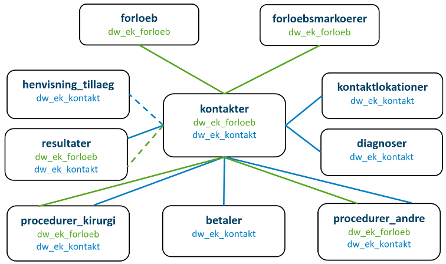

\newpage
\tableofcontents
\newpage

Prior to understanding the new structure it is important to understand what not to expect there:

**pop** was a dataset constructed by us which had pnr numbers from all dataset delivered. We used as the Danish population, but this is not entriely correct. In the new data structure you should use **bef** and **fain** to define the Danish Population.

**doede** does not excist. In the Death folder you can find causes of deaths from to periods and a file with all available death dates.

When updating from prior setup a large number of datasets have been deleted.  These datasets have been provided from external sources and during the period where people could take action to maintain these datasets no one has provided the necessary input.

Data to projects are provided from many sources, the most important being Statistics Denmark (DST) and the Health data organisation (Sundhedsdatastyrelsen, SDS).
Data from these sources are by DST conceived as "base data" (Grunddata) and are
systematically placed in a folder named **Grunddata**.

All other data will appear in a folder named **Eksterne data**.  This folder may be further organised depending on the project.

The current listing of dataset is very general and the project you are working on may contain fewer datasets or additional datasets.

This document provides an overview of the structure of **Grunddata**.  An important principle for the structure of data has been to change as little as possible to the orginal data supplied.  The reason for this is that it allows all users to interrogate DST and SDS for description of registers and definitions of variables.  These institutions have on their web-pages descriptions of datasets and well as variable explanations.

Register details from the Danish Health Data Authority (Sundhedsdatastyrelsen) is found here: https://sundhedsdatastyrelsen.dk/da/registre-og-services/om-de-nationale-sundhedsregistre
Register details from the Statistics Denmark is found here: https://www.dst.dk/extranet/forskningvariabellister/Oversigt%20over%20registre.html

A full list of all external data including variable explanations is found on DDV (Danmarks Data Vindue).

Data management with the new structure will result in changes of many programs. To ease this process we have written a SAS and R program to read data in a structured way.  These programs are found in V:/Alle/skeleton and are also visible on www.heart.dk/github/programming guidance/skeleton.

One very important change for many users is that we provide multiple files for each register according to the DST habit of having one file per year.  This change is made to ease data organisation as many users only need to interrogate data from selected years.  It further can help to increase speed of data processing by parallising calculations - the document **Parallel processing with SAS and R** describes this. Also, the programs for SAS/R enabling data management are available in the folder V:/data/alle/skeleton

The following headlines correspond to the subfolders in **Grunddata** on projects.

# Cancer
This includes the cancer registry from SDS (t_tumor)

# Death
**T_dodsaarsag_1** is the national cause of death register until 2001 when new death certificates were introduced

**T_dodsaarsag_2** is the new cause of death register. Note that attempts have been made to provide simple translations of new to olds cause of death definition, but this should be discouraged.  It is important to note the update of causes of death is very much delayed.

Simple registration of death is in the **dod** table.  This table combines information from DST (dod) and SDS (t_person) and is updated as much as other data in the project.  This dataset only cosntained date of death for deceased and is not described elsewhere.

# Krim
This folder contains information on criminal records and and related subjects.  Only available in selected folders.

# Laboratory
This folder first of all holds **lab_forsker**. NPU codes corresponding to tests are found in V:/data/alle/blodprøver.  Additionally there is a dataset **lab_labidcodes** which contains information on the laboratory where the tests were conducted. This may be useful for selected assays, but carries the caveat that information on laboratory may not be exported.

Historically we have collected laboratory results from willing sources and these are placed in separate subdirectories corresponding to the old municipal of Copenhagen (Kbh amt), Copenhagen general practitioners laboratory (KPLL), North Region of Denmark and Roskilde. The advantage of these datasets is that they reach further back in time than lab_forsker.

When relevant the **pato** register of microscope examinations is also supplied in this directory.

# LPR
LPR1 uses ICD8-codes and was 1994 replaced with LPR2 and ICD_10 codes. This continued until about march 2019 where LPR3 started.  LPR3 is structured very differently from LPR1/2.  It has therefore been decided to maintain the partially digested LPR1/2 data in the following deliveries:
**diag_indl** contains all diagnoses and selected administrative data.
**opr** includes all procedure codes and all examination codes (sksube) - again with added administrative data.

Some projects will also include **opr_old** which are ICD8 procedures prior to approximately 1994.  Other projects also have the file **lpr_bes** which are outpatient contacts from lpr2.

Psychiatric admissions were provided in independent tables. Note than occasionally psychiatric diagnoses appear in the somatic data, but not consistently.

LPR3 datasets are supplied without changes for the populations relevant for the project. Note that we have extensively reduced the number of datasets and variables provided not to overwhelm our servers. Basically the following four tables are made available: kontakter, diagnoser, procedurer_kirurgi and procedurer_andre.  For each table the number of variables has been substantially reduced and those interested in those removed need to request them for specific projects.

Those accustomes to LPR1/2 will be searching for diagnosis codes and procedure codes.  Of note in LPR3 is is not uncommon to find these fields with "TUL.." codes or other non-standard codes. Some of these refer to side of patients (left/right) and for others we do not know the meaning.  But when strange codes are used you will find that the field "..._parent" has a more ordinary codes.  

LPR3 contains the datasets provided in the figure. Additionally the key variables to connect data are shown. For a short introduction to LPR3 please see: https://github.com/ctpteam/DST/blob/master/Various%20Statistics%20Denmark%20(DST)%20manuals/Vejledning%20til%20LPR3_F.pdf

For a thorough introduction to LPR3 see: https://github.com/ctpteam/DST/blob/master/Various%20Statistics%20Denmark%20(DST)%20manuals/LPR_Indberetningsvejledning_lang.pdf

# Medication
This directory includes all **lmdb** files available.
Additional data regarding compounds can be found in **laegelmiddeloplysninger**, which in various updated versions are available on **V:/data/alle/LMDBdata**

# Mfr
**mfr** is the national birth register and this dataset has data from 1997-2019.

We have older data also
**mfr_lfoed** - born alive prior to 1997
**mfr_dfoed** - stillborn prior to 1997
**nydfoed_2010** and **nylfoed_2010** are also delivered and may not provide new data.

With the introduction of LPR3 all births from 2019 are found in the LPR3-table **nyfoedte**.

# Nursinghome
The dataset **plhjem** is the data we have from nursinghomes generated by DST by request from us and using the number of old people at an address to qualify an address to be examined as to whether is was a nursinghome.

From 2016 the more official data **aepi** has nursing home data.

The registers **aefv**, **aelh**, **aeph** and **aetr** are various types of personal assistance

# Population
The main population register is the **bef** tables for each year since 1985 and from 2008 each quater of a year.  This is the main official register to define danish residents at any time.

Prior to 1985 the **fain** tables provide some of the data found in **bef**.

In addition the dataset **sexBirth** provides date of birth and sex (0=female,1=male) available from the cpr-register (t_person). This particular dataset is not described further elsewhere.

Projects may or may not directly have the **t_person** register. Not that this register also includes legal parents and "C_STATUS" which is 90 for death and also includes information on migration and people disappeared.

Country of origin is found in the **iepe** dataset and all immigrations into and away from Denmark are found in the **vnds** table.

# Social
The tables **indXXXX** hvor Xs represent years include income and fortune of invididuals.  This table also includes individual income adjusted for family composition.  The table does not adjust for inflation.

The tables **uddaXXXX** has maximal education for all individuals.  There are SAS formats to translate to understandable values and also a R-function in heaven to do this.

The table **uddfXXXX** contains also maximal education.  Only the last year is necessdary to include as it is uptated with new data annually. It appears to include maximal education for more people than udda-files, perhaps because imported educations are also registered here.

The table **dreamXXXXXX** is an updated version of dream that for each week has codes indicating public support and for each month indication of association to particular working areas.

Some projects include **kotre** and **koto** which are student registers.  Further educational register may be available in selected projects.

# SSS
**SYSI** and **SSSY** are data from practitioners to many types representing different time periods.

# Other data
For all projects there is a folder named **External Data**.  The data in this folder can be found in the description files for the project - named variables and datasets.  Further explanations can be found in the approvals from DST and SDS or on DDV.

# V:/data/Alle
On the V-path subfolder "alle" is a number of moderately organised folders for a variety of anonymous and useful data.  Not in particular details of medication in LMDBdata, text versions of diagnoses in ICD8 and ICD10

Note also here the "skeleton" folder that includes sample programs to import data from the structure required by Statistics Denmark

# DST formats
On the desktop of Statistics Denmark there is a STAR called formats.  This provides access to multiple format that can be helpful for classifying complex codes.  For example the four digit final education can with these data be transformed to ISCED classes.
